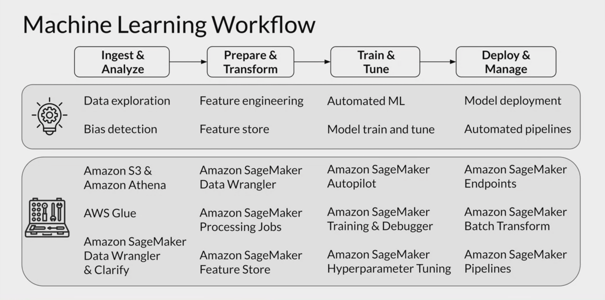

# Practical Data Science on the AWS Cloud Specialization

## Description
This repository is a collection of long-form notes to deepen understanding of concepts discussed in the [Practical Data Science on AWS Cloud Specialization](https://www.coursera.org/specializations/practical-data-science) on Coursera. The goal is to help bolster your understanding of the material and provide a reference for future use. Incomplete notebooks will also be provided for extra context, although self-completion is encouraged for the best learning experience.

## Structure of Specialization
1. [Analyze Datasets and Train ML Models using AutoML](https://www.coursera.org/learn/automl-datasets-ml-models?specialization=practical-data-science)
2. [Build, Train, and Deploy ML Pipelines using BERT](https://www.coursera.org/learn/ml-pipelines-bert?specialization=practical-data-science)
3. [Optimize ML Models and Deploy Human-in-the-Loop ML Pipelines](https://www.coursera.org/learn/ml-models-human-in-the-loop-pipelines?specialization=practical-data-science)

## Notes
### 1. Analyze Datasets and Train ML Models using AutoML

    Week 1: Explore the Use Case and Analyze the Dataset



__Data Lakes__

A data lake is a centralized repository that allows for the storage of structured and unstructured data at any scale. It enables the storage of data in its raw and original format and can handle a variety of data types. Data lakes also typically include tools for data management and are often used in conjunction with big data technologies like Hadoop and Spark. They are useful for storing and processing large amounts of data from various sources for analysis.

__AWS Data Wrangler, AWS S3, AWS Glue, and AWS Athena__

AWS Data Wrangler is a Python library that helps you extract, transform, and load (ETL) data from various sources into Amazon Web Services (AWS) data storage and analytics services, such as Amazon S3, Amazon Redshift, and Amazon Athena.

Here is an example of how you can use AWS Data Wrangler to extract data from a CSV file stored in Amazon S3, transform the data using Pandas, and load the transformed data into a table in Amazon Redshift:

import awswrangler as wr

```python
# Extract data from a CSV file stored in S3
df = wr.s3.read_csv(
    bucket="my-bucket",
    key="data.csv",
    session=wr.Session(region_name="us-east-1")
)

# Transform the data using Pandas
df["new_column"] = df["column1"] + df["column2"]
df = df.drop(columns=["column1", "column2"])

# Load the transformed data into a table in Amazon Redshift
wr.redshift.to_sql(
    df=df,
    name="table_name",
    con=wr.RedshiftCredentials(
        host="my-redshift-cluster.abc123xyz789.us-east-1.redshift.amazonaws.com",
        port=5439,
        database="database_name",
        user="username",
        password="password"
    )
)
```

Amazon S3 (Simple Storage Service) is an object storage service that allows you to store and retrieve large amounts of data from anywhere on the web. It is a scalable, high-speed, low-cost storage service that enables you to store and retrieve any amount of data, at any time, from anywhere on the web.

Here is an example of how you can use the AWS SDK for Python (Boto3) to upload a file to Amazon S3:

```python
import boto3

# Create an S3 client
s3 = boto3.client("s3")

# Upload the file to S3
s3.upload_file(
    Filename="file.txt",
    Bucket="my-bucket",
    Key="file.txt"
)
```

AWS Glue is a fully managed extract, transform, and load (ETL) service that makes it easy to move data between data stores. It is designed to be used in conjunction with Amazon S3, Amazon Redshift, and Amazon Athena.

The AWS Glue Data Catalog is a central repository that stores metadata information about data stored in data stores, such as Amazon S3, Amazon Redshift, and Amazon Athena. It allows you to store, annotate, and share metadata across data development and data management tools.

Here is an example of how you can use the AWS Glue Data Catalog API to list all the tables in the Glue Data Catalog:

```python
import boto3

# Create a Glue client
glue = boto3.client("glue")

# List all the tables in the Glue Data Catalog
response = glue.get_tables(
    DatabaseName="database_name"
)
tables = response["TableList"]
for table in tables:
    print(table["Name"])
```

An AWS Glue Crawler is a program that connects to a data store, extracts metadata, and creates table definitions in the AWS Glue Data Catalog. The AWS Glue Data Catalog is a central repository that stores metadata information about data stored in data stores, such as Amazon S3, Amazon Redshift, and Amazon Athena.

Here is an example of how you can use the AWS Glue API to create a Crawler that extracts metadata from a table in a MySQL database and creates a table definition in the AWS Glue Data Catalog:

```python
import boto3

# Create a Glue client
glue = boto3.client("glue")

# Create a connection to the MySQL database
glue.create_connection(
    ConnectionInput={
        "Name": "mysql-connection",
        "ConnectionType": "JDBC",
        "JDBCConnectionProperties": {
            "JDBC_CONNECTION_URL": "jdbc:mysql://host:port/database",
            "USERNAME": "username",
            "PASSWORD": "password"
        }
    }
)

# Create a Crawler that extracts metadata from the MySQL database and creates a table definition in the Glue Data Catalog
glue.create_crawler(
    Name="mysql-crawler",
    Role="GlueServiceRole",
    DatabaseName="database_name",
    TablePrefix="table_prefix",
    ConnectionName="mysql-connection",
    Targets={
        "SqlTargets": [
            {
                "Path": "database_name",
                "Exclusions": []
            }
        ]
    }
)
```

Amazon Athena is a query service that lets you analyze data in Amazon S3 using SQL. It is a fully managed service that enables you to analyze data directly from S3, without the need to set up any infrastructure or load data into a separate data warehouse.

Here is an example of how you can use the Amazon Athena API to execute a SQL query that returns the count of rows in a table stored in S3:

```python
import boto3

# Create an Athena client
athena = boto3.client("athena")

# Execute the SQL query
response = athena.start_query_execution(
    QueryString="SELECT COUNT(*) FROM s3://bucket/data/table",
    QueryExecutionContext={
        "Database": "database_name"
    },
    ResultConfiguration={
        "OutputLocation": "s3://bucket/results/"
    }
)

# Get the query execution ID
query_execution_id = response["QueryExecutionId"]

# Wait for the query to complete
while True:
    # Get the query execution status
    response = athena.get_query_execution(QueryExecutionId=query_execution_id)
    status = response["QueryExecution"]["Status"]["State"]

    # If the query is complete, break the loop
    if status == "SUCCEEDED":
        break

    # Sleep for a few seconds before checking the status again
    time.sleep(5)

# Get the query results
response = athena.get_query_results(QueryExecutionId=query_execution_id)

# Print the count of rows
count = response
print(count)
```


__In progress...__